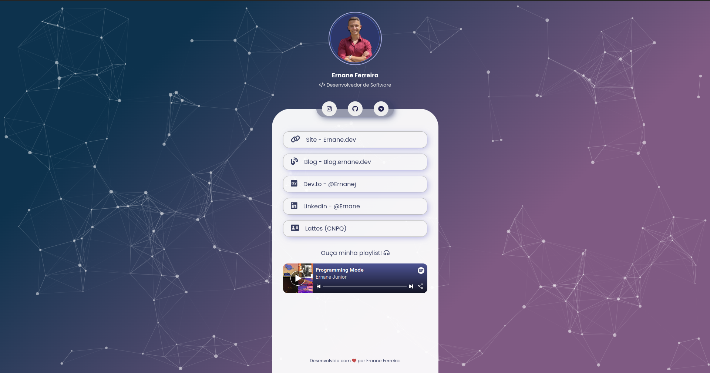

<h1 align="center">
  <strong>  Links | Ernane.dev </strong>
</h1>

<div align="center" style="border-radius: 10px;">
  
</div>

</p>

## 💻 Projeto
<p>
  Sistema customizado para apresentar de maneira elegante, prática e rápida alguns links principais.
</p>
<p> <a target="_blank" href="https://links.ernane.dev">Clique aqui</a> para acessar.</p>

## 💡 Use
- Clone este repositorio
  ```bash
  git clone https://github.com/ErnaneJ/links.git
  ```
- Instale as dependencias...
  
  ```bash
  cd me
  npm install
  ```

- Execute a aplicacao:

  ```bash
  npm run dev
  ```

Acesse [localhost:5000](http://localhost:5000).

---

<div align="center">
  <br>
  Desenvolvido com ❤ por <a target="_blank" href="https://links.ernane.dev">Ernane Ferreira</a> 👋🏻
</div>
